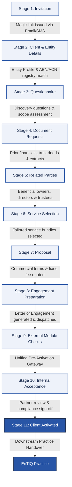
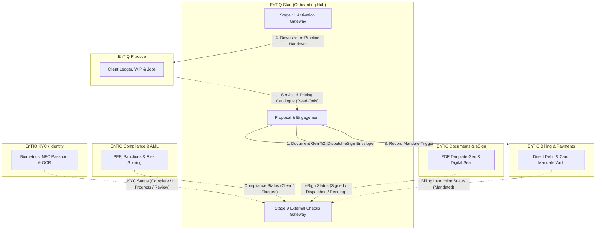

# EnTIQ Start — Complete Architectural & Workflow Master Guide

**EnTIQ Start** is the client onboarding orchestrator and engagement gateway of the EnTIQ Practice Suite. It manages the prospect-to-client conversion pipeline across an 11-stage lifecycle, delegating specialized operations (identity verification, AML scoring, document rendering, payment processing, and practice management) to companion modules via clean handoff contracts.

---

## 1. System Architecture & Tech Stack

```
+----------------------------------------------------------------------------------------------------+
|                                      FRONTEND ARCHITECTURE                                         |
|  - Framework: React 18 + TypeScript                                                                |
|  - Bundler & Dev Server: Vite 6.3.5                                                                |
|  - Styling: Tailwind CSS + PostCSS + CSS Variables                                                 |
|  - Iconography: Lucide React                                                                       |
|  - State Management: React Context API (AuthProvider, NavigationContext) + Custom Hooks             |
+----------------------------------------------------------------------------------------------------+
                                                │ REST API (JSON) + Bearer Token / API Key
                                                ▼
+----------------------------------------------------------------------------------------------------+
|                                       BACKEND ARCHITECTURE                                         |
|  - Web Framework: Python 3.11+ FastAPI                                                             |
|  - ORM / Persistence: SQLAlchemy 2.0 + SQLite (Development) / PostgreSQL (Production)              |
|  - Data Validation: Pydantic v2 Models                                                             |
|  - Security: Argon2/PBKDF2 Password Hashing, JWT Tokens, Bearer API Keys                           |
|  - Email Dispatch: Python smtplib / STARTTLS + HTML Templating Engine                              |
+----------------------------------------------------------------------------------------------------+
```

---

## 2. The Clean 11-Stage Client Onboarding Lifecycle

EnTIQ Start owns the client journey from initial prospect engagement to practice activation:



### Stage-by-Stage Operational Details:

| Stage # | Stage Name | Primary Actor | Inputs & Triggers | System Operations & Outputs |
|---|---|---|---|---|
| **1** | **Invitation** | Advisor / Admin | Client Name, Email, Phone, Service Type | Generates secure magic link token, registers invitation in database, triggers SMTP email dispatch to client. |
| **2** | **Client & Entity Details** | Client (Portal) / Advisor | Legal name, entity type (Company, Trust, Individual), ABN/ACN | Runs Australian Business Register (ABR) / ASIC registry lookup, validates tax residency and registered address. |
| **3** | **Questionnaire** | Client (Portal) | Prior accountant details, accounting software (Xero/MYOB), tax year status | Captures operational context, flags complexity items (e.g. overseas income, foreign trust beneficiaries). |
| **4** | **Document Requests** | Client (Portal) | File uploads (Prior tax returns, financial statements, Trust deeds) | Securely vaults uploaded documents, marks checklist items as received, timestamps receipts. |
| **5** | **Related Parties** | Client / Advisor | Co-directors, shareholders, trustees, beneficiaries | Maps organizational hierarchy and identifies Ultimate Beneficial Owners (UBOs) owning >25%. |
| **6** | **Service Selection** | Advisor / Client | Service catalog selections (Tax returns, BAS, Advisory, Bookkeeping) | Calculates engagement price options based on published fee catalogue and entity tier. |
| **7** | **Proposal** | Advisor / Client | Scope summary, fee breakdown, billing options | Presents interactive proposal with deliverables schedule and billing cadence. |
| **8** | **Engagement Prep** | Advisor | Proposal template, terms of business | Dispatches document generation request to **EnTIQ Documents**, pre-populating engagement terms. |
| **9** | **External Module Checks** | Automated Gateway | Status signals from companion modules | Evaluates the 4 pre-flight checks: KYC status, AML/PEP clearance, eSign execution, and payment mandate authorization. |
| **10** | **Internal Acceptance** | Practice Partner | Pre-flight verification checklist, conflict-of-interest sign-off | Formal compliance review, margin conformance confirmation, and partner sign-off signature. |
| **11** | **Client Activated** | System / Practice | Partner approval signal | Marks case status as `Accepted` (100% progress), transitions prospect to active client, dispatches **Downstream Practice Handover** to **EnTIQ Practice**. |

---

## 3. External Module Boundaries & The 7 Handoff Contracts

EnTIQ Start maintains zero business logic for KYC verification, AML scoring, document rendering, payment processing, or WIP management. It communicates via 7 explicit contracts:



---

## 4. Frontend Component & Screen Directory

```
src/
├── app/
│   ├── App.tsx                    # Root application container, Sidebar, Dashboard, Onboarding Cases Drawer
│   ├── BillingScreen.tsx          # Billing & payments reference module
│   ├── DocumentBuilderScreen.tsx  # Interactive proposal & engagement document template builder
│   ├── IntegrationsScreen.tsx     # Module Connectors & Webhooks status monitor
│   ├── NavigationContext.ts       # Navigation routing context & modal trigger state
│   ├── ProcessBuilderScreen.tsx   # Visual React Flow node/edge onboarding workflow builder
│   ├── ServicesScreen.tsx         # Proposal service catalogue & fee schedule manager
│   ├── shared.tsx                 # Shared UI components (PageShell, Table components, Badge indicators)
│   └── components/
│       ├── ApiKeyModal.tsx        # API Key generation, database connection & credential manager
│       ├── ClientOnboardingPortal.tsx # Public-facing client magic link onboarding portal
│       ├── EmailSettingsModal.tsx # SMTP credentials & email server tester
│       ├── Header.tsx             # Universal search, notification center, user profile switcher
│       └── ui/                    # Reusable primitives (Buttons, Cards, Dialogs, Selects, Drawers)
├── contexts/
│   └── AuthContext.tsx            # Authentication state, JWT tokens, mock multi-user switcher (Partner/Manager)
├── lib/
│   └── api.ts                     # TypeScript API client handling all REST calls to the FastAPI backend
└── types/
    └── api.ts                     # TypeScript type definitions matching backend Pydantic schemas
```

---

## 5. Complete Backend REST API Reference

All backend endpoints are prefixed with `/api/v1` and support Bearer Token / API Key authentication:

### 1. Authentication & System (`/api/v1/auth`, `/api/v1/email`)
- `POST /api/v1/auth/login` — Authenticate user credentials and return JWT bearer token.
- `GET /api/v1/auth/me` — Return authenticated user profile and firm context.
- `GET /api/v1/email/config` — Get current SMTP email server configuration.
- `PUT /api/v1/email/config` — Update SMTP host, port, credentials, and from-address.
- `POST /api/v1/email/test` — Send live diagnostic test email to verify SMTP delivery.

### 2. Onboarding Cases & Pipeline (`/api/v1/cases`)
- `GET /api/v1/cases` — Retrieve paginated onboarding cases with status, risk, and search filters.
- `POST /api/v1/cases` — Create a new onboarding case record.
- `GET /api/v1/cases/{case_id}` — Retrieve full case dossier including entity profile and document receipts.
- `PATCH /api/v1/cases/{case_id}` — Update case metadata, assigned advisor, due date, or progress.
- `PATCH /api/v1/cases/{case_id}/status` — Advance case status across the 11-stage pipeline.
- `POST /api/v1/cases/{case_id}/request-info` — Dispatch email requesting missing documents or identity details.
- `DELETE /api/v1/cases/{case_id}` — Delete case record.

### 3. Invitations & Magic Link Intake (`/api/v1/invitations`)
- `GET /api/v1/invitations` — List all client invitations with delivery and open statuses.
- `POST /api/v1/invitations` — Create a new invitation and trigger SMTP magic link email dispatch.
- `GET /api/v1/invitations/public/{inv_id}` — **Public endpoint** (no auth) for client onboarding portal intake.
- `POST /api/v1/invitations/public/{inv_id}/submit` — **Public endpoint** for client submitting signed details.

### 4. Engagements & Proposals (`/api/v1/engagements`, `/api/v1/templates`)
- `GET /api/v1/engagements` — List active engagements and fee proposals.
- `POST /api/v1/engagements` — Draft a new fee proposal and letter of engagement.
- `GET /api/v1/templates` — List engagement letter templates and clause libraries.
- `POST /api/v1/templates` — Author a new engagement template.

### 5. Services & Pricing Catalogue (`/api/v1/services`)
- `GET /api/v1/services/items` — List active service offerings (Individual Tax, Company Tax, Advisory, BAS).
- `GET /api/v1/services/fees` — List standard fee schedule and pricing rules.
- `GET /api/v1/services/staff` — List staff charge-out rates synced from EnTIQ Practice.

---

## 6. How to Run, Test, and Build the Project

### Prerequisites
- Node.js 18+ and npm
- Python 3.11+ and pip

### Running the Frontend
```bash
# Install dependencies
npm install

# Start development server (http://localhost:5173)
npm run dev

# Compile production build
npm run build
```

### Running the Backend
```bash
# Navigate to project root
cd "c:\Users\DELL\Downloads\Entiq Start 1 2"

# Install backend dependencies
pip install fastapi uvicorn sqlalchemy pydantic python-dotenv email-validator pydantic-settings

# Start FastAPI server on port 8000
uvicorn backend.app.main:app --reload --host 0.0.0.0 --port 8000
```
- Interactive Swagger UI documentation: `http://localhost:8000/api/v1/docs`
- ReDoc documentation: `http://localhost:8000/api/v1/redoc`
