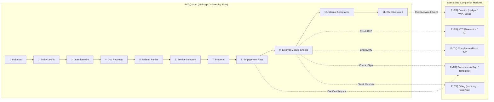

# EnTIQ Start Architectural Boundary Alignment Plan

Align **EnTIQ Start** strictly with its single architectural mandate: **Client Onboarding Orchestrator & Engagement Gateway**, owning the 11-stage client onboarding pipeline while cleanly interfacing with companion modules (**EnTIQ KYC**, **EnTIQ Compliance & AML**, **EnTIQ Documents & eSign**, **EnTIQ Billing & Payments**, and **EnTIQ Practice**).

---

## User Review Required

> [!IMPORTANT]
> **Key Architectural Boundary Changes in this Refactoring:**
> 1. **Billing & Payments Screen Removal from Start Primary Nav**: The full billing ledger/invoice processing (`BillingScreen.tsx`) is moved out of Start's sidebar navigation. In Start, billing is represented as the **Billing Instruction Mandate Status** (captured during Engagement preparation and displayed in the External Module Checks gateway).
> 2. **Global Integrations Re-scoping**: Global enterprise administration (Global Xero tenant setup, M365 tenant auth, Didit API keys) is scoped out of Start. Start retains only its **Onboarding Webhooks & Companion Module Connectors**.
> 3. **Services & Pricing Refocus**: `ServicesScreen.tsx` is streamlined to be a **Proposal Service Catalogue** (authoring and selecting service bundles & fixed fees for proposals) without staff hourly charge-out rate cards or WIP tracking (which belong to EnTIQ Practice).
> 4. **11-Stage Pipeline Formalization**: The Onboarding Cases view explicitly formalizes the 11 sequential stages:
>    `Invitation` ➔ `Client/Entity Details` ➔ `Questionnaire` ➔ `Document Requests` ➔ `Related Parties` ➔ `Service Selection` ➔ `Proposal` ➔ `Engagement Preparation` ➔ `External Module Checks` ➔ `Internal Acceptance` ➔ `Client Activated`.
> 5. **External Module Checks Gateway (Stage 9)**: Consolidates the 4 external verification statuses (KYC status from EnTIQ KYC, Compliance/AML status from EnTIQ Compliance, eSign status from EnTIQ Documents, Payment Mandate status from EnTIQ Billing) before Partner sign-off.
> 6. **Downstream Practice Handover (Stage 11)**: On final partner sign-off, Start emits the activation event to provision the client record and matter folders in EnTIQ Practice.

---

## Proposed Changes

---

### Component 1: Navigation & Module Re-scoping

#### [MODIFY] [App.tsx](file:///c:/Users/DELL/Downloads/Entiq%20Start%201%202/src/app/App.tsx)
- Refactor `NAV_ITEMS` to focus cleanly on onboarding capabilities:
  - **Start Dashboard** (`dashboard`)
  - **Onboarding Pipeline (11 Stages)** (`cases`)
  - **Invitations & Intake** (`invitations`)
  - **Clients & Entities** (`clients`)
  - **Proposals & Engagements** (`engagements`)
  - **Process & Workflow Builder** (`process-builder`)
  - **Onboarding Activity Log** (`activity`)
- Remove standalone `Billing & Payments` (`BillingScreen`) from Start primary sidebar.
- Refactor `SETTINGS_ITEMS` to:
  - **Proposal Templates** (`templates`)
  - **Proposal Services Catalogue** (`services`)
  - **Companion Module Connectors** (`integrations` - focused on webhook connections to EnTIQ KYC, Billing, Documents, Practice)
  - **API Keys & DB** (`apikeys`)

---

### Component 2: Stage 9 — External Module Checks Gateway

#### [MODIFY] [App.tsx](file:///c:/Users/DELL/Downloads/Entiq%20Start%201%202/src/app/App.tsx)
- Formalize **Stage 9 (External Module Checks)** in the case drawer and review modals:
  - **KYC Status Card**: Shows status (`Complete`, `In Progress`, `Review Required`, `Not Started`) with verified identity attributes and deep link to EnTIQ KYC.
  - **Compliance / AML Card**: Shows PEP/Sanctions screening flag (`Cleared`, `Flagged`, `Pending`) and risk rating computed by EnTIQ Compliance.
  - **eSign Status Card**: Shows signing state (`Signed`, `Dispatched`, `Viewed`, `Pending`) with timestamp from EnTIQ Documents.
  - **Billing Mandate Card**: Shows recorded payment instruction (`Direct Debit Authorised`, `Card Mandate on File`, `Invoice on Activation`).

---

### Component 3: Stage 10 & 11 — Internal Acceptance & Practice Handover

#### [MODIFY] [App.tsx](file:///c:/Users/DELL/Downloads/Entiq%20Start%201%202/src/app/App.tsx)
- Enhance **Partner Acceptance Review Modal** (Stage 10):
  - Pre-flight checklist validating all 4 External Module Checks are satisfied.
  - Partner sign-off signature / timestamp.
- On Acceptance ➔ **Stage 11 (Client Activated)**:
  - Triggers **Downstream Practice Handover** event (`EnTIQ Practice Handover Payload`).
  - Displays instant visual confirmation of activation and link to view in EnTIQ Practice.

---

### Component 4: Services & Proposal Catalogue Streamlining

#### [MODIFY] [ServicesScreen.tsx](file:///c:/Users/DELL/Downloads/Entiq%20Start%201%202/src/app/ServicesScreen.tsx)
- Streamline `ServicesScreen.tsx` to act strictly as the **Proposal Service & Pricing Catalogue**:
  - Author service bundles, deliverables, and fixed fees for proposals.
  - Remove staff hourly charge-out rate cards and internal WIP tracking (relocated to EnTIQ Practice).

---

## Verification Plan

### Automated Verification
- Run TypeScript build check: `npm run build` or `npx tsc --noEmit` to verify zero type errors.
- Test frontend server startup: verify `npm run dev` builds cleanly without warnings.

### Manual Verification
1. **Navigation Verification**: Confirm sidebar displays the clean Start onboarding items.
2. **11-Stage Pipeline Flow**:
   - Create a new onboarding case (`Manoj Sharma / TechVentures Pty Ltd`).
   - Advance through stages 1 to 8 (`Invitation` ➔ `Engagement Prep`).
   - Verify Stage 9 (`External Module Checks`) displays the 4 clean status handoffs (KYC, Compliance, eSign, Billing Instruction).
   - Execute Stage 10 (`Internal Acceptance`) with Partner sign-off.
   - Verify Stage 11 (`Client Activated`) emits the Downstream Practice Handover signal.
