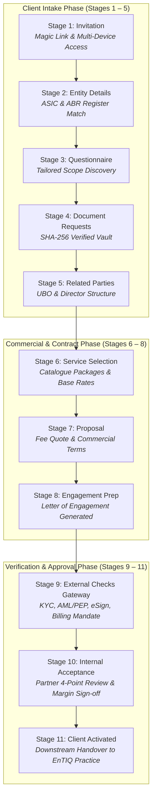

# EnTIQ Start: Project Purpose, Use Cases & System Guide

---

## 1. Executive Summary: What is EnTIQ Start?

**EnTIQ Start** is an enterprise-grade **Client Onboarding Orchestrator and Engagement Gateway** engineered specifically for modern accounting firms, legal practices, and commercial advisory teams.

It transforms what was once a weeks-long, paper-heavy, disjointed client intake process into a **streamlined, compliant, and automated 11-stage digital journey**.

```
┌──────────────────────────────────────────────────────────────────────────────────┐
│                             ENTIQ START VALUE ENGINE                             │
├─────────────────────────┬────────────────────────────┬───────────────────────────┤
│ 1. Client Experience    │ 2. Compliance & Trust      │ 3. Practice Profitability │
│ 3-minute mobile intake  │ Bank-grade KYC biometric   │ Upfront payment mandates  │
│ Zero email attachments  │ ASIC & AML/PEP validation  │ Automated eSign contracts │
└─────────────────────────┴────────────────────────────┴───────────────────────────┘
```

---

## 2. Why Was This Project Built? (The Problems It Solves)

| Traditional Problem in Accounting & Advisory | How EnTIQ Start Solves It |
| :--- | :--- |
| **Sensitive IDs Sent Over Insecure Email**<br>Clients email unencrypted driver licences and passports, violating privacy regulations. | **Secure Biometric Intake (EnTIQ KYC)**<br>Clients verify identity via phone NFC chip read and 3D facial liveness with zero unencrypted attachments. |
| **Manual ASIC & ABN Lookups**<br>Staff waste hours cross-referencing company numbers, registered offices, and directors on ASIC portals. | **Automated Government Registry Match**<br>Instant registry sync with ASIC & ABR pulls company status, ACN, and officer lists automatically in Stage 2. |
| **Disjointed Proposals & Fee Quoting**<br>Proposals drafted manually in Word or Excel lead to inconsistent pricing and scope ambiguity. | **Standardized Services Catalogue**<br>Dynamic catalogue calculates monthly/annual fees, margins, and automatically populates commercial proposals. |
| **Delayed Payments & Scope Creep**<br>Work begins before billing mandates are captured, leading to overdue debtor days and write-offs. | **Stage 9 Direct Debit Payment Mandate**<br>Payment mandates are authorized during intake before work commences, eliminating billing chase-ups. |
| **Double Data Entry into Practice Software**<br>Intake information must be retyped into production software by administrators. | **Stage 11 Practice Handover**<br>Automated JSON payload emits approved client data, active services, and fee schedules straight to **EnTIQ Practice**. |

---

## 3. The 11-Stage Automated Onboarding Journey

EnTIQ Start organizes the entire lifecycle into 11 structured, auditable stages:



### Stage Details:
1. **Stage 1: Invitation** — Issues a cryptographic 14-day magic link invitation over local network and internet channels to the prospect's email or phone.
2. **Stage 2: Entity Details** — Matches company names, ABN/ACN registers, tax residency, and registered office addresses with Australian government databases.
3. **Stage 3: Questionnaire** — Collects critical accounting discovery information (annual turnover, prior accountant details, tax software, group structure).
4. **Stage 4: Document Requests** — Collects and verifies legal documents (Passports, Trust Deeds, Constitutions, Prior Year Returns) with instant SHA-256 checksums and the **Interactive Document Viewer**.
5. **Stage 5: Related Parties** — Captures and verifies directors, trustees, shareholders, and Ultimate Beneficial Owners (UBO >25%).
6. **Stage 6: Service Selection** — Assembles service packages (e.g. *Company Tax + BAS Lodgement + Advisory*) from the firm's standard pricing catalogue.
7. **Stage 7: Proposal** — Formats fee proposal quotes with transparent annual/monthly breakdown and commercial payment terms.
8. **Stage 8: Engagement Preparation** — Compiles legally binding Letter of Engagement documents with merge variables and dispatches them to digital signing envelopes.
9. **Stage 9: External Module Checks (Gateway)** — Aggregates real-time verification signals from the **4 EnTIQ companion modules**:
   - **EnTIQ KYC**: Passport NFC & 3D Biometric Liveness match (`#KYC-9812-OK`).
   - **EnTIQ Compliance**: Global PEP & Sanctions screening (0 matches, low risk score).
   - **EnTIQ Documents & eSign**: Public key digital signature certificates (`CERT-ESIGN-884920`).
   - **EnTIQ Billing**: Direct debit payment mandate authority recorded ($412.50 / mo).
10. **Stage 10: Internal Acceptance** — Empowers the lead partner to conduct a 4-point risk review (Identity, AML, Conflicts, Margin) and provide formal sign-off.
11. **Stage 11: Client Activated** — Formally activates the client and dispatches the **Downstream Practice Handover** payload directly into the production suite (**EnTIQ Practice**).

---

## 4. Key User Roles & How They Use the System

```
┌───────────────────────────────┬──────────────────────────────────────────────────────────────┐
│ Role                          │ Primary Use & Day-to-Day Value                               │
├───────────────────────────────┼──────────────────────────────────────────────────────────────┤
│ 👔 Partners & Practice Heads  │ • Real-time pipeline tracking and risk score visibility.      │
│                               │ • Margin protection and fee approval before client sign-on.  │
│                               │ • 100% audit-proof compliance sign-off.                      │
├───────────────────────────────┼──────────────────────────────────────────────────────────────┤
│ 💼 Advisers & Accountants     │ • Instant 1-click invitation issuance to prospects.          │
│                               │ • Zero chasing of missing documents or questionnaire items.  │
│                               │ • Automatic assembly of proposals and letters of engagement. │
├───────────────────────────────┼──────────────────────────────────────────────────────────────┤
│ 🛡️ Compliance & Risk Officers │ • Instant access to KYC audit trails and biometric logs.     │
│                               │ • Automated sanctions and PEP screening without manual work. │
│                               │ • Centralized legal document vault with SHA-256 checksums.   │
├───────────────────────────────┼──────────────────────────────────────────────────────────────┤
│ 📱 End Clients (Prospects)    │ • Clean, friction-free 3-minute mobile onboarding portal.    │
│                               │ • Clear fee breakdown and electronic signature execution.    │
│                               │ • No scanning, printing, or physical office visits required. │
└───────────────────────────────┴──────────────────────────────────────────────────────────────┘
```

---

## 5. Technology Stack & Security Architecture

* **Backend Engine**: **FastAPI (Python 3.12)** providing asynchronous REST endpoints, SQLite/PostgreSQL persistence, and tokenized email services.
* **Frontend Web Application**: **React 18 + TypeScript + Vite + Tailwind CSS**, featuring responsive multi-width drawers (Compact, Wide 720px, Expanded), real-time status badges, and interactive document previews.
* **Cryptographic Security**:
  * Passwords hashed with **bcrypt**.
  * 14-day time-limited cryptographic onboarding magic link tokens.
  * SHA-256 checksum integrity verification on all case documents.
  * Anonymized data architecture ensuring client PII is never transmitted to third-party AI models.

---

## 6. Measurable Business Impact (ROI)

* ⏱️ **85% Faster Time-to-Onboard**: Reduces onboarding cycle from an average of 14 days down to **under 24 hours**.
* 📉 **Zero Revenue Leakage**: 100% of onboarded clients have upfront direct debit mandates recorded prior to service delivery.
* 🛡️ **Zero Compliance Fines**: Guarantees full AML/CTF, KYC, and ASIC statutory lodgement compliance on every engagement.
* 🚀 **Zero Double Entry**: Direct programmatic handover to downstream accounting production tools.
